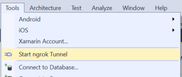

# Ngrok Extensions for Visual Studio

[](https://ci.appveyor.com/project/dprothero/ngrokextensions/branch/master)

This extension allows you to use [ngrok](https://ngrok.com) right from within Visual Studio.
It will start a tunnel for each web application that is part of your solution.

Currently has only been tested in Visual Studio 2015.

## Installation

### Install ngrok

First thing, you need to [download ngrok](https://ngrok.com/download) and install it somewhere
in your path. You can also get ngrok as a [Chocolatey package](https://chocolatey.org/packages/ngrok.portable).

You can find detailed [Windows installation instructions for ngrok here](https://www.twilio.com/docs/guides/how-use-ngrok-windows-and-visual-studio-test-webhooks).

### Install this Extension

#### From Visual Studio

Get it from the [Visual Studio Gallery](https://visualstudiogallery.msdn.microsoft.com/56a642ed-a5e0-4044-8735-740d36912c5e).
From within Visual Studio:

1. Select Tools... Extensions and Updates...
2. Click "Online" and select the "Visual Studio Gallery" along the left-hand side of the window.
3. Type "ngrok" into the search box in the upper right.
4. Click the "Download" button on the extension in the search results.

#### Build from Source

1. Clone this repo
2. Open with Visual Studio 2015 and build a `Release` build
3. Find the .vsix file in the `bin\Release` folder
4. Double-click the .vsix file to install

## Usage

Currently, usage is super-simple. All you need to do is open a solution with
one or more web projects and then choose "Start ngrok Tunnel" from the "Tools"
menu.



### Custom ngrok Subdomains

If you have a paid ngrok account, you can make use of custom subdomains with
this extension.

Specify the subdomain you would like it to use in a `ngrok-subdomain` key
in the `appSettings` section of your `web.config` file like so:

```xml
<?xml version="1.0" encoding="utf-8"?>
<configuration>
  <appSettings>
    <add key="ngrok-subdomain" value="my-cool-app"/>
    ... more appSettings keys omitted ...
  </appSettings>
  ... more config omitted ...
</configuration>
```

## Feedback and Contribution

This is a brand new extension and would benefit greatly from your feedback
and even your code contribution.

If you find a bug or would like to request a feature,
[open an issue](https://github.com/dprothero/NgrokExtensions/issues).

To contribute, fork this repo to your own GitHub account. Then, create a
branch on your own fork and perform the work. Push it up to your fork and
then submit a Pull Request to this repo. This is called [GitHub Flow](https://guides.github.com/introduction/flow/).

* * *

Licensed under the MIT license. See the LICENSE file in the project root for more information.

Copyright (c) 2016 David Prothero
